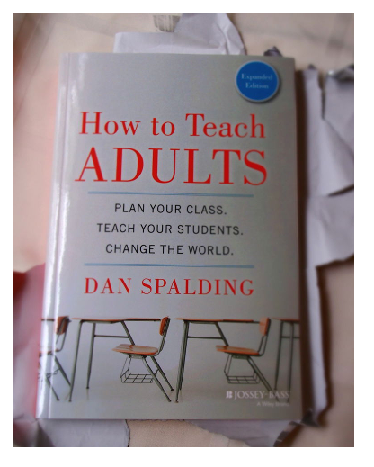
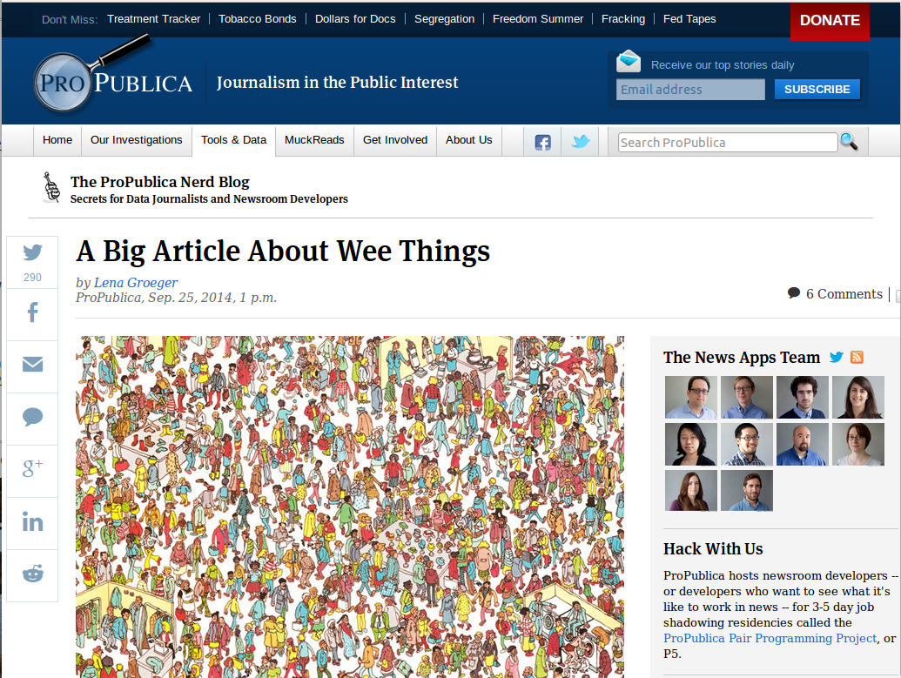
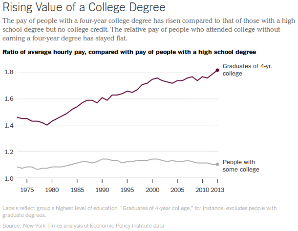
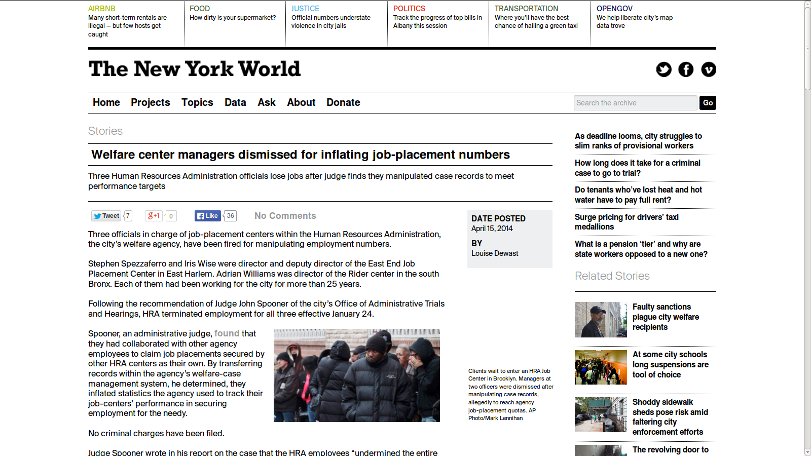
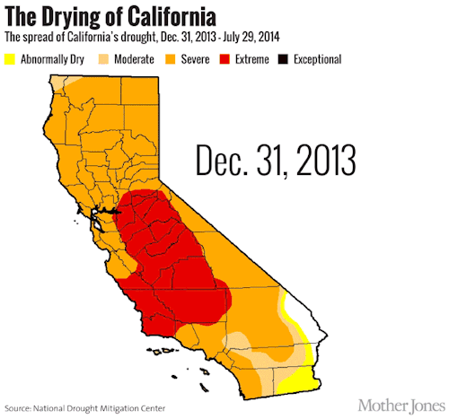

##Tow Fellowship Symposium 2014
#Telling Better Stories with Data
##Amanda Hickman | @amandabee  
  

NOTES:
I know a little bit about you from your bios, but I'd love to get a sense of your experience and the kind of data you already have access to.  What are your major hurldes?  How confident are you working with data? Displaying it?

--v--

# <http://bit.ly/JohnJay14>

-----
# Why Visualize?

NOTES:
We know these things about how adults learn. About the human brain. We could scuttled down some [developmental psychology rabbit holes](http://en.wikipedia.org/wiki/Learning_styles#Fleming.27s_VAK.2FVARK_model)
  here, but we know that some people learn better if they can see something visualized. Some people are tactile learners, they need to be able to manipulate something themselves. And what that means for us is that more people can get more out of your reporting if you incorporate visual storytelling alongside your text.

See also: <http://neomam.com/interactive/13reasons/>

--v--

## Data Visualization Changes Stories

NOTES: The real reason we do this is because it tells a story.

-----
<section data-background="imgs/CIR_guzzles.png">
    <small class="caption">[California water officials aren't following own call for conservation](https://beta.cironline.org/reports/california-water-officials-arent-following-own-call-for-conservation/)</small>
    <aside class="notes">It is one thing to say "this dude uses three tiems as much water as anyone else. It's another thing to actually look at how each of these officials stacks up. I'm usually opposed to gimicks like the house icon here, but it really drives home how much more water these officials are using. </aside>

</section>
<section data-background="/talks/2014/Dodge/latimes.png">
    <small class="caption">[How fast is LAFD where you live?](http://graphics.latimes.com/how-fast-is-lafd/#10/33.9661/-118.6201)</small>
    <aside class="notes">In Nov of 2012, th LA Times started reporting on serious problems in the city's 911 system. One of the things you can really see in this project is how much of the city is affected. </aside>
</section>

<section data-background="/talks/2014/Dodge/sfpp_quake.png">
  <small class="caption">[San Francisco Public Press](http://sfpublicpress.org/softstorylist)</small>
  <aside class="notes">San Francisco Public Press got ahold of a list of buildings that the city had identified as being vulnerable to earthquakes -- the city had been sitting on the list for several years, but after SFPP published their story about these buildings, the board of supervisers got cracking on legislation to require the buildings be retrofitted. </aside>
</section>

<section data-background="imgs/slide26.png">
    <small class="caption">[WNYC Stop and Frisk](http://project.wnyc.org/stop-frisk-guns/)</small>
</section>

<section data-background="imgs/slide27.png">
    <small class="caption">[Steven Rmalewski's Take](http://spatialityblog.com/2012/07/27/nyc-stop-frisk-cartographic-observations/)</small>
</section>

<section data-background="imgs/slide28.png">
    <small class="caption">[WNYC Teen Stop and Frisk](http://project.wnyc.org/stop-frisk-teens/index.html)</small>
</section>

<section data-background="imgs/nyt_pd-race-gap.png">
    <small class="caption">[The Race Gap in America’s Police Departments](http://www.nytimes.com/interactive/2014/09/03/us/the-race-gap-in-americas-police-departments.html)</small>
</section>

-----

# More Deep Dives

+ NPR on [Unintended Accelleration](http://www.npr.org/templates/story/story.php?storyId=124276771)
+ Milwaukee Journal Sentinel on [board paychecks](http://www.jsonline.com/watchdog/watchdogreports/97242609.html)
+ Alabama.com on [NCAA concussion lawsuits](http://www.al.com/sports/index.ssf/2014/02/whos_suing_the_ncaa_alcom_data.html)

-----

# What Makes Data Viz Work?

--v--
## Small Multiples

<small>From [NY Times, Justice Denied](http://www.nytimes.com/2013/04/14/nyregion/justice-denied-bronx-court-system-mired-in-delays.html), April 13, 2013</small>

--v--

NOTES:
Piling the data together in one chart requires me to work more -- there's no way to read this chart without checking the key.

--v--

## Sometimes you don't need a chart.

<small>[What If the Data Visualization is Actually People?](https://source.opennews.org/en-US/learning/what-if-data-visualization-actually-people/)</small>

--v--

Lena Groeger has a [great writeup on the value of going small](http://www.propublica.org/nerds/item/a-big-article-about-wee-things).

--v--

## Show don't tell

<small>From *NY Times*, [Is College Worth It? Clearly, New Data Say](http://www.nytimes.com/2014/05/27/upshot/is-college-worth-it-clearly-new-data-say.html)</small>

NOTES:
One of the ways that outlets like the NY Times stand out is how they wrap their data. You'll never read a caption like "The chart below shows..." -- words are precious, so conserve them.

--v--
## Make the most of your space

NOTES:
Look for white space and find a way to use it.

--v--
## Don't make me work
--v--

NOTES:
This also happens to be a bit silly because the real takeaway here is "Busy Stations are Busy" which I hope doesn't come as a great surprise. But even to get that far I have to look at the chart, Look up at the top right where it explains that the y-axis is Weekends, remember that the Y axis is the horizontal one, and then the grid isn't even in squares. The point of a visualization is to make the numbers *easier* to understand. Not harder.

--v--
## Don't move the axis

<small>[Media Matters for America](http://mediamatters.org/blog/2012/07/31/dishonest-fox-chart-bush-tax-cut-edition/189046), July 31, 2012.</small>

--v--

 

<small>NPR's ["It's all politics"](http://www.npr.org/blogs/itsallpolitics/2013/02/13/171935151/chart-check-did-obama-s-graphics-enhance-his-big-speech) fact checked President Obama's 2013 State of the Union slides.

NOTES: Fox definitely doesn't have a monopoly on distorting the Y axis. There are times when you're going to be tempted to zoom in, but make sure you're confident that you aren't grossly distoring the numbers.

--v--
## Continuous Things on a Continuum

<small>From *Gothamist*, April 10, 2013</small>

NOTES:
And, while you're in there, ask yourself if you need a key!

Pixels are precious.

--v--
## Numbers Have Perspective, too

<small>*NY Times* [One Report, Divergint Perspectives](http://www.nytimes.com/interactive/2012/10/05/business/economy/one-report-diverging-perspectives.html), October 5, 2012</small>

--v--
## Numbers are the easiest thing to change

<small>*New York World*, [Welfare center managers dismissed for inflating job-placement numbers](http://www.thenewyorkworld.com/2014/04/15/welfare-center-managers-dismissed/), April 15, 2014</small>

-----

<section data-background="imgs/drugging_kids.png">
    <small class="caption">[Drugging our Kids](http://webspecial.mercurynews.com/druggedkids/)</small>
    <aside class="notes">Many of you are already incorporating some data visualization work:

Karen De Sa incorporated a great timeline into her package, [Drugging our Kids](http://webspecial.mercurynews.com/druggedkids). </aside>
</section>

<section data-background="imgs/torque.png">
    <small class="caption">[Britain's Royal Navy in the First World War](http://www.theguardian.com/news/datablog/interactive/2012/oct/01/first-world-war-royal-navy-ships-mapped), animated with [Torque](https://github.com/CartoDB/torque)</small>
    <aside class="notes">I actually think Karen's timeline is great, but I can also picture an animation that shows just the locations of the child's many foster homes over time.</aside>
</section>

<section>
     
    <small><a href="http://www.motherjones.com/blue-marble/2014/07/watch-drought-take-over-entire-state-california">Watch Drought Take Over the Entire State of California in One GIF</a></small>

</section>

-----

# Great Tools

--v--
## For Charts

+ [Highcharts](http://www.highcharts.com/)
+ [ChartBuilder](http://quartz.github.io/Chartbuilder/)
+ [and some more](http://www.fastcodesign.com/3029239/infographic-of-the-day/30-simple-tools-for-data-visualization) tools other folks like

--v--

## For Maps

+ [Story Map](http://storymap.knightlab.com/)
+ [CartoDB](http://cartodb.com)
+ [CartoDB Torque]()

--v--

## For Ideas

+ SPJ has a [heap of links](http://journaliststoolbox.org/archive/2014/09/online-journalism.html)
+ I keep a [tumblr](http://jour72312.tumblr.com/) for my data visualization class.

-----
# Where to find data:

## <http://bit.ly/JohnJay14-data>

<https://github.com/amandabee/cunyjdata/wiki/Where-to-Find-Data-(Juvenile-Justice-Edition)>

NOTES:
I keep a wiki for my data visualization classes. I'll be working with a handful of fellows on data and visualization projects and I'm hoping we can really flesh out that wiki page.

-----
# Do we have any time left?

--v--

## Let's dig in!

+ [NYC Average Daily Inmate Population](https://data.cityofnewyork.us/Public-Safety/Average-Daily-Inmate-Population/26ze-s5bx)
+ [Highcharts Basic Bar](http://www.highcharts.com/demo/bar-basic)
+ [Mister Data Converter](https://shancarter.github.io/mr-data-converter/)
+ [Highcharts Documentation](http://api.highcharts.com/highcharts)

--v--

## <http://jsfiddle.net/1bgn4j02/7/>

My first pass.

-----

## amanda.hickman@journalism.cuny.edu
## @amandabee

 
