  
#Data Journalism and Fiscal Policy
##Amanda Hickman, CUNY Graduate School of Journalism
##Quoctrung Bui, Planet Money

NOTES:
Welcome, who we are. 
  

--v--

## <http://piratepad.net/ravitch2015>

  
-----
<section data-background="imgs/opendatamap_2015.png">
    <small class="caption">[Sunlight Open Data Map](http://sunlightfoundation.com/policy/opendatamap/)</small>
    <aside class="notes">I want to talk a little bit about open data, because it is relevant and important. Over the last decade, countless municipalities have updated existing open records legislation with open *data* laws that mandate that agencies make data available to citizens in usable formats. </aside>
</section>
  
<section data-background="imgs/council_discretionary.png">
  <small class="caption">[City Council Discretionary Funding](https://data.cityofnewyork.us/City-Government/New-York-City-Council-Discretionary-Funding-2009-2/m3fi-rt3ks)</small>
  <aside class="notes">New York City has a pretty good open data law, but the city's budgets are either exempt or just not enforced. But things like
[member items](http://www.wnyc.org/story/remember-member-items/) are really just trickling in and a lot of budget data either isn't there or isn't accessible. 

  Until very recently, that information was published in a PDF. So if you wanted to, you know, look at it, you had to leap through flaming hoops. It is [now available](https://data.cityofnewyork.us/City-Government/New-York-City-Council-Discretionary-Funding-2009-2/m3fi-rt3k). Much of the rest of the city budget is also available, though hard to muddle through.

  So this is a plea to you all to realize and understand that not having access to data makes reporting harder, makes accountability harder, isn't okay. Generally.</aside>
</section>

<section>
    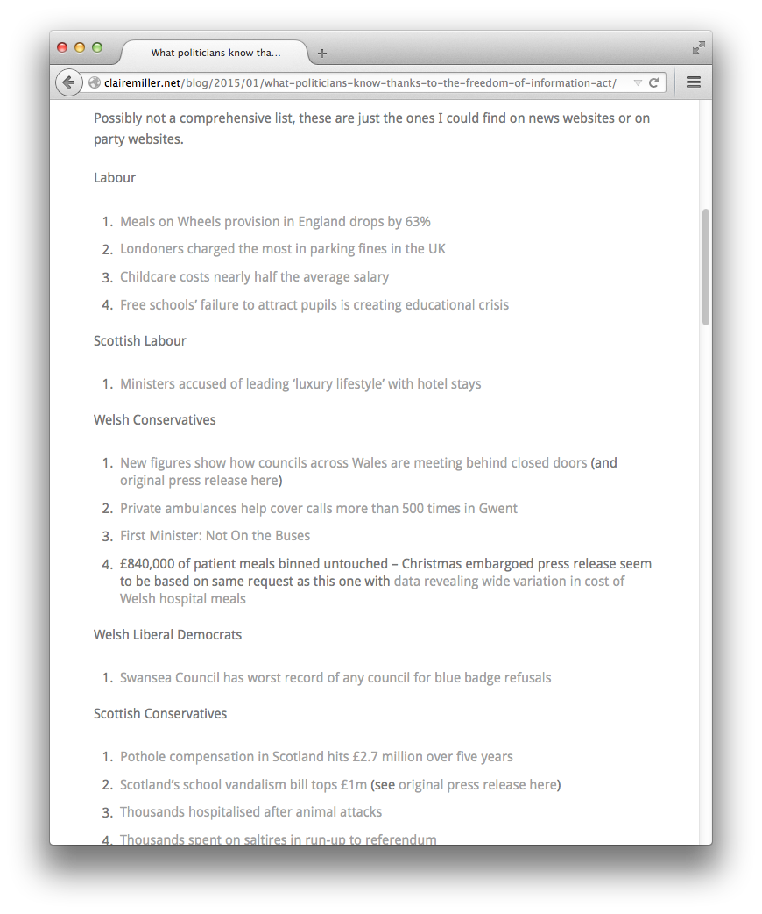  
    [What politicians know thanks to the Freedom of Information Act](http://clairemiller.net/blog/2015/01/what-politicians-know-thanks-to-the-freedom-of-information-act/), Clair Miller, January 5, 2015
	<aside class="notes">Welsh journalist Clair Miller keeps a great list of things politicians know that they wouldn't without FOI.</aside>
</section>
  
-----

## Why visualize? 
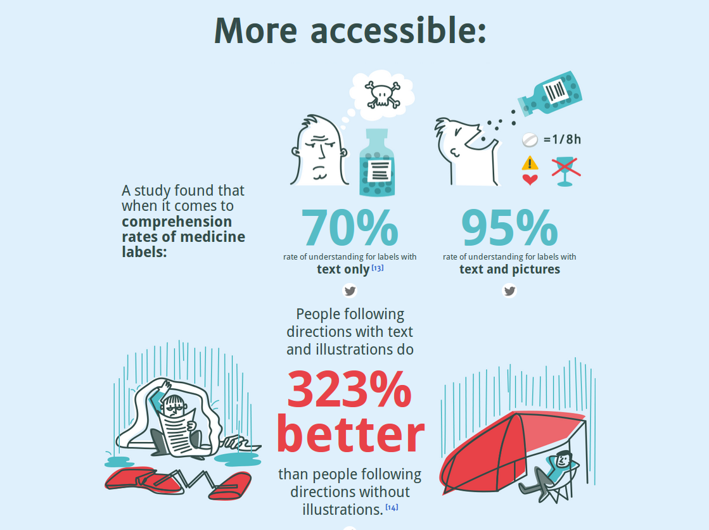
  
  
NOTES:

See also: <http://neomam.com/interactive/13reasons/>

--v--
## Data Visualization Changes Stories

--v--

[Broken bonds](http://apps.chicagotribune.com/bond-debt/), *Chicago Tribune*, Dec 7, 2013

NOTES: 

This is a great report from the Trib. Spend some time in it. 

--v--

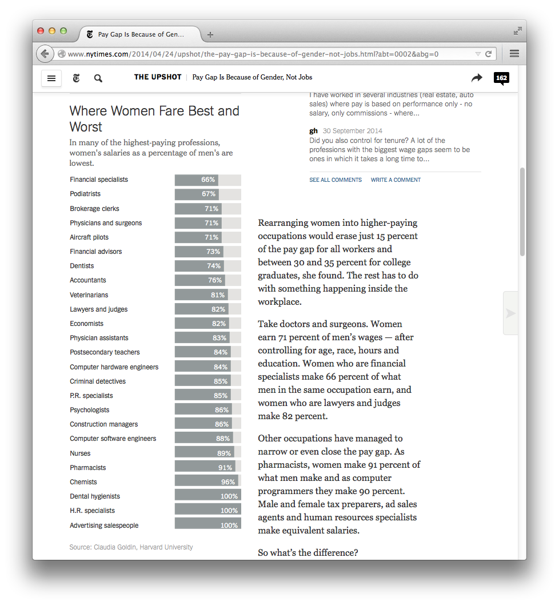
[Pay Gap Is Because of Gender, Not Jobs](http://www.nytimes.com/2014/04/24/upshot/the-pay-gap-is-because-of-gender-not-jobs.html), *New York Times*, April 23, 2014

NOTES:
Charts let you show me all the numbers, even the ones that don't make it into the text.

--v--

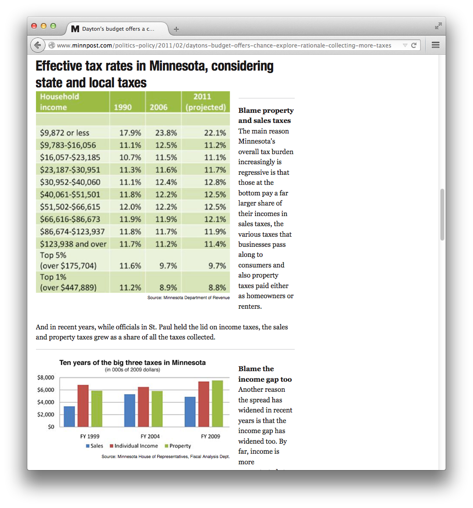
[Dayton's budget offers a chance to explore the rationale for collecting more taxes](http://www.minnpost.com/politics-policy/2011/02/daytons-budget-offers-chance-explore-rationale-collecting-more-taxes), *Minn Post*, February 15, 2011

NOTES:
I don't love this, visually, but sometimes all you want to show is how the numbers stack up. 

--v--

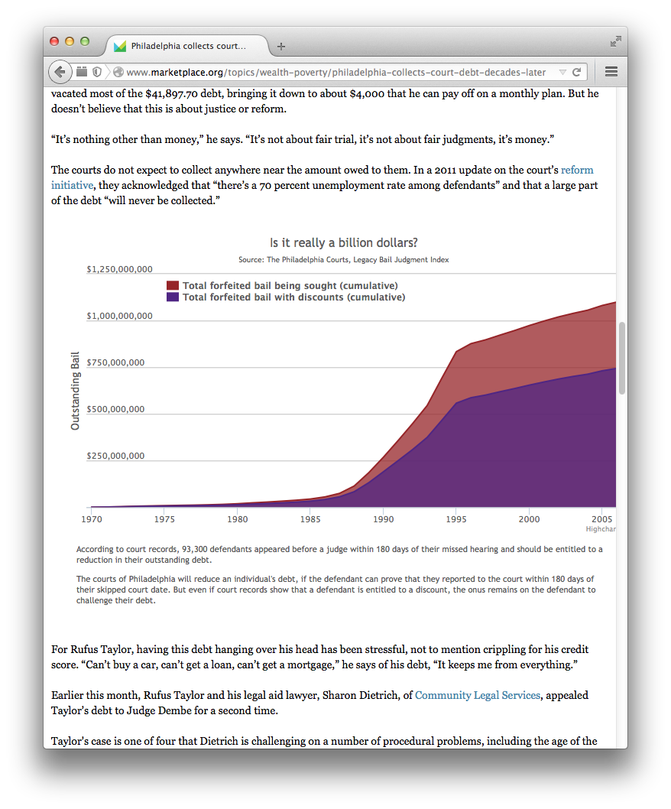
[Philadelphia collects court debt decades later](http://www.marketplace.org/topics/wealth-poverty/philadelphia-collects-court-debt-decades-later), Marketplace, December 20, 2012

NOTES: 
Charts are great for comparisons.

-----
  
  <section data-background="imgs/npr_foster.png">
    <small class="caption">[NPR](http://www.npr.org/2011/10/25/141475618/disproportionality-rates-of-native-american-children-in-foster-care)</small>
    <aside class="notes">Data Visualization provides context. NPR did some reporting that is a little old at this point, though few of the details have changed as far as I know. They looked into data that showed that native kids in South Dakota were significantly more likely to be placed in foster care than white kids, even when the circumstances were similar, and that native kids were overwhelmingly going to (and, according to the Lakota People's Law Project being prescribed anti-psychotics at much higher rates --SJ Merc did a similar story on prescription drugs in CA. You should all do that story.) white foster homes. Their data viz piece looked at all fifty states and flagged the states where native kids are substantially more likely to be in foster care and in non-native homes. </aside>
  </section>
  <section data-background="imgs/wnyc_prek.png">
    <small class="caption">[WNYC](http://project.wnyc.org/schoolbook-prek/)</small>
    <aside class="notes">You can clearly see where there are not nearly enough Pre K seats to go around.  </aside>
  </section>
  <section data-background="imgs/sandy_propublica.png">
    <small class="caption">[ProPublica](http://projects.propublica.org/sandy-sba/)</small>
    <aside class="notes">You can see where SBA loans are going along the Sandy-struck coast.</aside>
  </section>
  <section data-background="imgs/sandy_propublica_njzoom.png">
    <small class="caption">[propublica](http://projects.propublica.org/sandy-sba/)</small>
    <aside class="notes"></aside>
  </section>  
  <section data-background="imgs/fema_buyouts.png">
    <small class="caption">[FEMA Is Buying Out Flood-Prone Homes, But Not Where You Might Expect](http://www.npr.org/blogs/thetwo-way/2014/10/20/357611987/map-femas-buying-out-flood-prone-homes-but-not-where-you-might-expect)</small>
    <aside class="notes">October 20, 2014</aside>
  </section>
  
  <section data-background="imgs/pay_gap_alt.png">
    <small class="caption">[Pay Gap Is Because of Gender, Not Jobs](http://www.nytimes.com/2014/04/24/upshot/the-pay-gap-is-because-of-gender-not-jobs.html), New York Times, April 23, 2014</small>
    <aside class="notes"></aside>
  </section>

  <section data-background="imgs/trib_cha.png">
    <small class="caption">[Chicago Tribune](http://apps.npr.org/lookatthis/posts/publichousing/)</small>
    <aside class="notes"></aside>
  </section>
  <section data-background="imgs/trib_cha2.png">
    <small class="caption">[Chicago Tribune](http://apps.npr.org/lookatthis/posts/publichousing/)</small>
    <aside class="notes"></aside>
  </section>
  <section data-background="imgs/pta1.png">          
    <small class="caption"><a href="http://sfpublicpress.org/">San Francisco Public Press</a></small>
    <aside class="notes"></aside>
  </section>
   
  <section data-background="imgs/residential_invest.png">          
    <small class="caption"><a href="http://www.nytimes.com/2014/04/27/upshot/the-housing-market-is-still-holding-back-the-economy-heres-why.html?rref=upshot">Why the Housing Market Is Still Stalling the Economy</a></small>
    <aside class="notes">
     Clean. Focus on the data. 
    </aside>
  </section>

-----
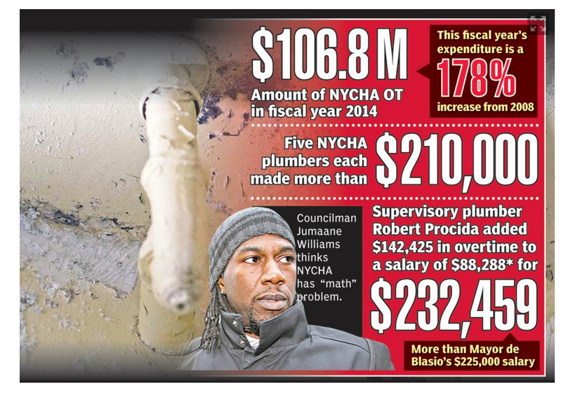 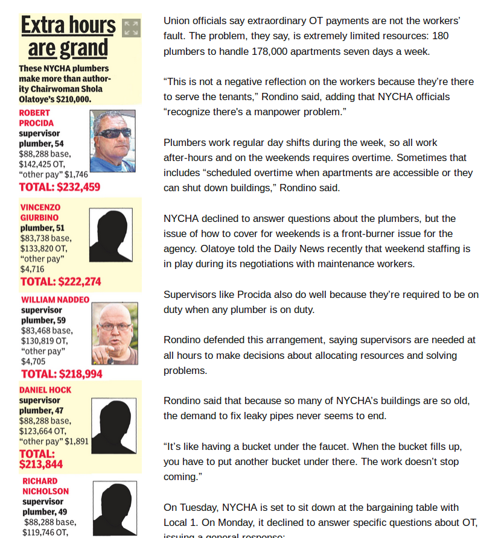

[City Council members confront NYCHA over skyrocketing overtime costs](http://www.nydailynews.com/news/politics/nycha-confronted-council-skyrocketing-overtime-costs-article-1.2048002), *New York Daily News*, December 17, 2014; [NYCHA paid $106 million in overtime to workers in 2014 — with plumbers at top of list](http://www.nydailynews.com/new-york/exclusive-nycha-paid-106-million-overtime-2014-article-1.2046654) *New York Daily News*, December 16, 2014

NOTES:
Even without a visualization, data is pretty powerful stuff. Ross Keith pulled up NYCHA salary data and was more or less rummaging around in it when he realized that NYCHA Plumbers take home *a lot* of overtime pay. His NY Daily News Cover story has led to City Council Hearings. 

-----

[Numbers aren't everything](http://www.thenewyorkworld.com/2014/04/15/welfare-center-managers-dismissed/) -- it is always easier to [juke the statistics](http://www.latimes.com/local/la-me-crimestats-lapd-20140810-story.html#page=1) than change the facts

 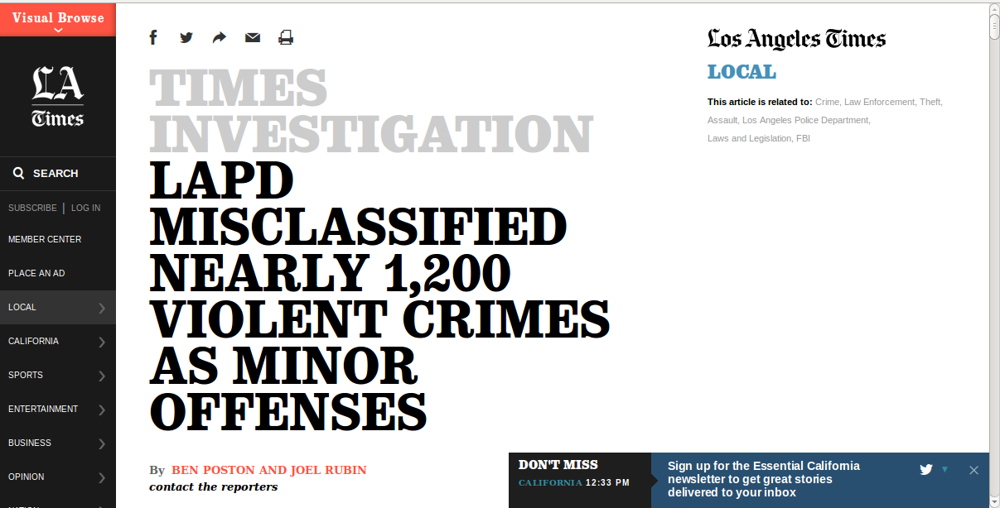

--v--

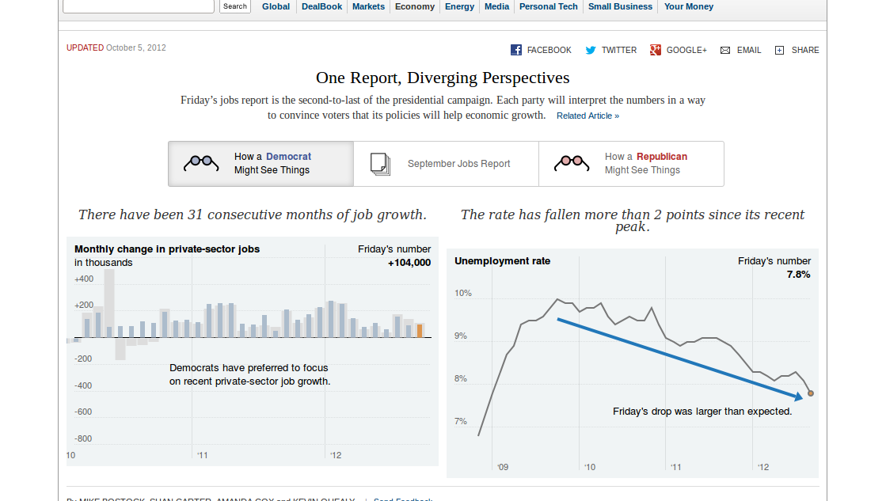

[One Report, Diverging Perspectives](http://www.nytimes.com/interactive/2012/10/05/business/economy/one-report-diverging-perspectives.html), *New York Times*, May 10, 2012

NOTES: 
Visualizations aren't neutral.

-----  

  
  
-----

## There Are Rules

+ [Be Complete](/talks/completeness)
+ [Watch Your Axes](/talks/2013/aug092013/)
+ Keep it readable -- don't [distort your pie chart](http://finalbossform.com/post/95231880775/felony-gun-possession-illegal-possession-of-military), for instance. 

+ [Less is More](https://speakerdeck.com/player/87bb9f00ec1e01308020727faa1f9e72#)
+ Know your encoding. [Data Viz Catalog](http://www.datavizcatalogue.com/)
+ Make it look good. [Not like this](http://finalbossform.com/post/95231880775/felony-gun-possession-illegal-possession-of-military) or [this](http://www.dailywireless.org/2014/07/28/more-broadband-subs-than-video-subs/) or [this](http://ilovecharts.tumblr.com/post/88368733301/hi-guys-today-im-headed-down-to-the-white)

--v--
** Don't [confuse correlation and causation](http://www.businessinsider.com/spurious-correlations-by-tyler-vigen-2014-5#ixzz31FAUIoTZ)**

 

-----

# Hands On!

NOTES:
We have some good hands on projects to tackle. 

--v--

## Tools We Use
+ [CartoDB](http://cartodb.com/)
+ R (and [RStudio](http://rstudio.com/))
+ [LibreOffice Calc](http://libreoffice.org/calc)
+ [Highcharts](http://www.highcharts.com/)
+ [D3](http://d3js.org/)
+ [QGIS](http://qgis.org/en/site/)

--v--

## More super easy tools:
* Medium's [Charted](https://medium.com/data-lab/introducing-charted-15161b2cd71e)
* [Datawrapper](http://Datawrapper.de)
* Quartz's [ChartBuilder](http://quartz.github.io/Chartbuilder/)
* [RAW](http://app.raw.densitydesign.org/) -- for flat graphics to edit in illustrator
* Theres been a lot of chatter about <http://silk.co> and people love Tableau, but I often have trouble loading graphics from both. I've had Tableau embeds crash my browser on more than one computer. Plus, it isn't [free](https://www.gnu.org/philosophy/free-sw.html)

-----
## What makes good data viz work?

[Less is More](https://speakerdeck.com/player/87bb9f00ec1e01308020727faa1f9e72)

--v--

[For Women in Tech, Pay Gap Is Unusually Small](http://www.nytimes.com/2014/04/25/upshot/flexibility-is-the-reason-for-a-smaller-pay-gap-in-tech-work.html)

NOTES:
Make the most of your space.

--v--

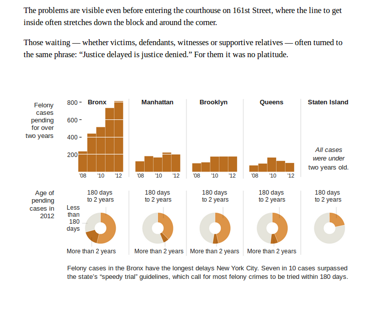

[A Court System Mired in Delays](http://www.nytimes.com/2013/04/14/nyregion/justice-denied-bronx-court-system-mired-in-delays.html), *New York Times*; April 4, 2014

NOTES: 
Sometimes Small Multiples do a much better job.

--v--

NOTES:
If we put this all on one chart it is a lot harder to read.

--v--

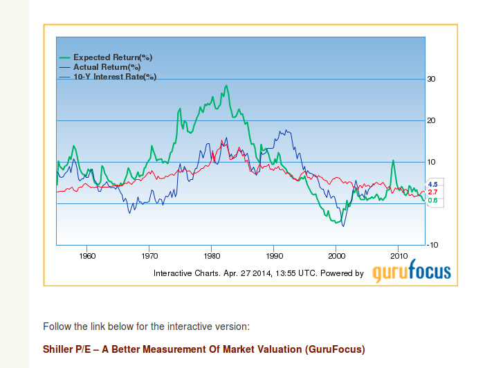  

[Shiller CAPE vs Implied Return](http://www.thereformedbroker.com/2014/04/27/shiller-cape-vs-implied-return)

  
NOTES:
Do things for a reason. This is pretty typical. Why is the green line fatter than the rest. Do we really need to know this is an interactive chart? What am I supposed to be looking at? What is the blue wash adding? We could clean this up. A lot. 

--v--

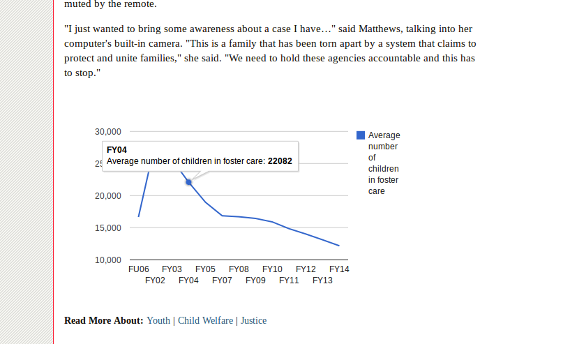  
[Group Amplifies Complaints by Foster-Care Parents, Kids](http://www.citylimits.org/news/articles/5098/group-amplifies-complaints-by-foster-care-parents-kids), *City Limits*, April 8, 2014

NOTES:
Check your work. We're not in the habit of proofreading data visualizations, but what is going on here? Is this nationally? What should I be taking away from this? And what the heck is "FU 06"?

--v--

Don't just [throw a ton of numbers at me](http://www.washingtonpost.com/business/economy/hospice-profits-vs-quality-care/2014/12/26/0becc386-8d40-11e4-8ff4-fb93129c9c8b_graphic.html) -- tell me what I'm looking for. Unless you're just trying to fill space, in which case, go for it. Go fill that space. 

If it doesn't belong on a continuum, don't put it on a continuum. What goes between ["Male Driver" and "City Street"](http://www.dailydot.com/politics/race-and-ferguson-police-visualization/)?

--v--

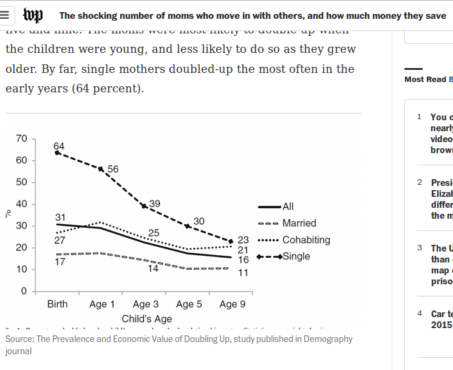

[The shocking number of moms who move in with others, and how much money they save](http://www.washingtonpost.com/blogs/wonkblog/wp/2014/12/31/the-shocking-number-of-moms-who-move-in-with-others-and-how-much-money-they-save/) (and while you're at it, know the difference between "moving" and "staying") 

NOTES: 
Probably worth scrolling down to look at the last image and talk about formats and not putting text inside of a picture.

-----

  <section data-background="imgs/small_mult_worldcup.png">  
    <small class="caption"><a href="http://www.theguardian.com/football/interactive/2013/dec/18/world-cup-2014-draw-strength-of-schedule#gia-wc-draw-matches-title">Who has the hardest World Cup 2014 draw?</a></small>
    <aside class="notes">Never put more than two items in a pie chart, but you can make lots of pie charts.</aside>
  </section>

