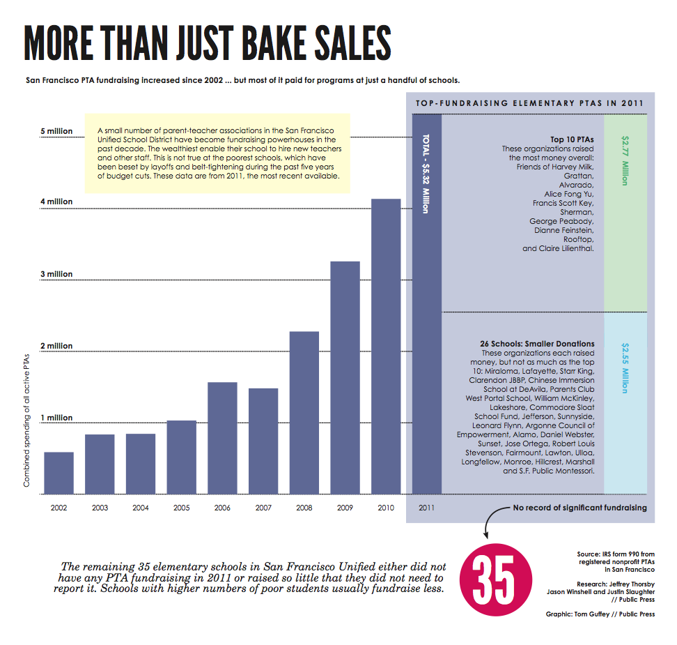
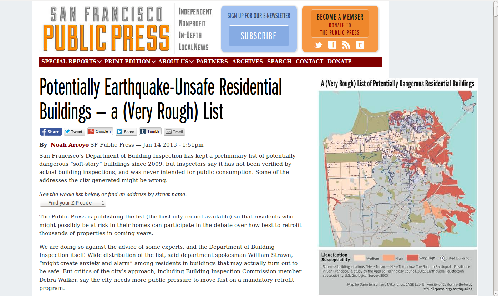
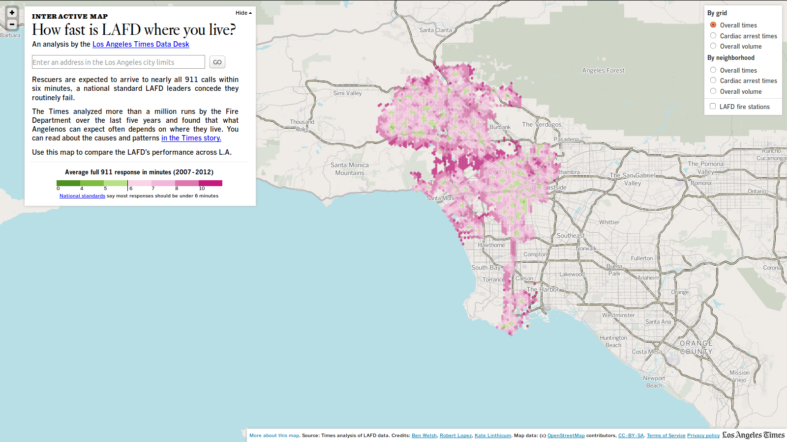
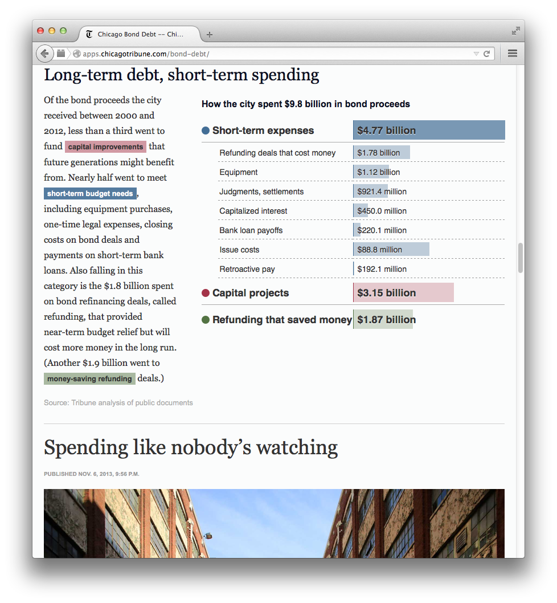

#San Francisco Public Press 2015 Annual Meeting
##Amanda Hickman

NOTES:
I moved back to San Francisco this year after two decades away, most of that in New York City where I worked in journalism (some) and community organizing (some) and most recently taught data visualization at CUNY Graduate School of Journalism.

--v--

[More Than Just Bake Sales](http://sfpublicpress.org/news/2014-02/how-budget-cuts-and-PTA-fundraising-undermined-equity-in-san-francisco-public-schools)

NOTES:

The Public Press has been doing great data work since long before I got here.

--v--

[San Francisco Public Press](http://sfpublicpress.org/softstorylist)

NOTES:  
San Francisco Public Press got ahold of a list of buildings that the city had identified as being vulnerable to earthquakes -- the city had been sitting on the list for several years, but after SFPP published their story about these buildings, the board of supervisors got cracking on legislation to require the buildings be retrofitted.
-----

NOTES:
Some really important caveats about data. What do you think is the best way to reduce the number of arsons? Redefine arson. Start classifying deaths as accidents instead of homicides and ... boom! Your murder rate plummets.

--v--

[Numbers aren't everything](http://www.thenewyorkworld.com/2014/04/15/welfare-center-managers-dismissed/)...

--v--

...  it is always easier to [juke the statistics](http://www.latimes.com/local/la-me-crimestats-lapd-20140810-story.html#page=1) than change the facts

-----

[October 2014   Center for Investigative Reporting](https://beta.cironline.org/reports/california-water-officials-arent-following-own-call-for-conservation/)

NOTES:
It is one thing to say "this dude uses three times as much water as anyone else." It's another thing to actually look at how each of these officials stacks up.

--v--

[Nov 2012, Los Angeles Times  How fast is LAFD where you live?](http://graphics.latimes.com/how-fast-is-lafd/#10/33.9661/-118.6201)

NOTES:
In Nov of 2012, th LA Times started reporting on serious problems in the city's 911 system. One of the things you can really see in this project is how much of the city is affected. 

--v--

[WNYC, 2012](http://project.wnyc.org/stop-frisk-teens/index.html)

--v--
 

[City Council members confront NYCHA over skyrocketing overtime costs](http://www.nydailynews.com/news/politics/nycha-confronted-council-skyrocketing-overtime-costs-article-1.2048002), *New York Daily News*, December 17, 2014; [NYCHA paid $106 million in overtime to workers in 2014 — with plumbers at top of list](http://www.nydailynews.com/new-york/exclusive-nycha-paid-106-million-overtime-2014-article-1.2046654) *New York Daily News*, December 16, 2014

NOTES:
Even without a visualization, data is pretty powerful stuff. Ross Keith pulled up NYCHA salary data and was more or less rummaging around in it when he realized that NYCHA Plumbers take home *a lot* of overtime pay. His NY Daily News Cover story has led to City Council Hearings.

--v--

[Dec 2013, Broken bonds](http://apps.chicagotribune.com/bond-debt/), *Chicago Tribune*, Dec 7, 2013

NOTES:

This is a great report from the Trib. Spend some time in it.

--v--

[CrashStat](http://crashstat.org/)

NOTES:
For years, Transportation Alternatives collected data on pedestrian and cyclist fatalities. [CrashStat](http://crashstat.org/) is a map of those crashes. And it allowed them to identify stretches of city streets that are particularly dangerous to bikers and walkers.

  They compiled the data from annual DOT releases, I believe they had to FOIA the data in some years.

--v--  

A crashstat remake on [CartoDB](http://t.co/tJx8lNmSqF)

NOTES:

In 2014, New York city released [data on motor vehicle collisions](https://data.cityofnewyork.us/NYC-BigApps/NYPD-Motor-Vehicle-Collisions/h9gi-nx95) -- the details of more than 300,000 collisions. The folks at CartoDB, [mapped that data](http://t.co/tJx8lNmSqF) with a different look. I don't know yet what will come of this but if New York City is going to achieve Vision Zero, more people need to be looking at where the dangerous intersections are.

-----

<section data-background="../imgs/lawhelp_map.png">
  <aside class="notes">LawHelpNY used the 311 call data to map not-so-hot spots in New York city. Then, according to Wilneida Negron, they reached out to tenant and housing groups in the neighborhoods with the most complaints, offered them the map for their own advocacy work and circulated Know Your Rights resources and legal aid referrals.

  > We took this information and reached out to housing and tenant groups in the
  neighborhoods with the most complaints (it turned out to be a specific triangle of neighborhoods in the Bronx) and provided them with the code to the map so they could embed into their websites and use for their own advocacy work and we also circulated Know Your Rights resources about tenants rights to heating and apartment repairs (timely because it was such a cold winter!).  So we used it to target our online outreach, provide grassroots groups with a visualization tool to advance their own work, and provide targeted know your rights information and legal aid referrals in those communities with the highest rates of heating complaints.
  </aside>
  </section>

<section data-background="../imgs/trib_cha.png">
  <small class="caption">[Chicago Tribune](http://apps.npr.org/lookatthis/posts/publichousing/)</small>
  <aside class="notes"></aside>
</section>

  <section data-background="../imgs/trib_cha2.png">
    <small class="caption">[Chicago Tribune](http://apps.npr.org/lookatthis/posts/publichousing/)</small>
    <aside class="notes"></aside>
  </section>

  <section data-background="../imgs/wnyc_prek.png">
    <small class="caption">[WNYC](http://project.wnyc.org/schoolbook-prek/)</small>
    <aside class="notes">You can clearly see where there are not nearly enough Pre K seats to go around.  </aside>
  </section>
  <section data-background="../imgs/sandy_propublica.png">
    <small class="caption">[ProPublica](http://projects.propublica.org/sandy-sba/)</small>
    <aside class="notes">You can see where SBA loans are going along the Sandy-struck coast.</aside>
  </section>
  <section data-background="../imgs/fema_buyouts.png">
    <small class="caption">[FEMA Is Buying Out Flood-Prone Homes, But Not Where You Might Expect](http://www.npr.org/blogs/thetwo-way/2014/10/20/357611987/map-femas-buying-out-flood-prone-homes-but-not-where-you-might-expect)</small>
    <aside class="notes">October 20, 2014</aside>
  </section>

  <section data-background="../imgs/axis_philly.png">
    <small class="caption">[Axis Philly](http://www.axisphilly.org/)</small>
  <aside class="notes">Axis Philly is a local news startup in Philadelphia. </aside>
  </section>

-----

#Stay in Touch

@amandabee

@openlab | @sfpublicpress

