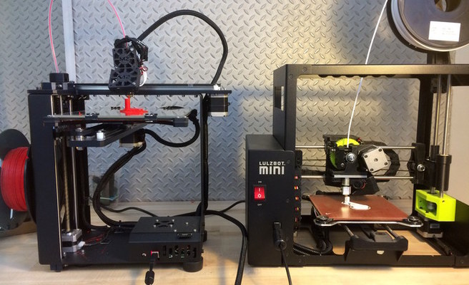
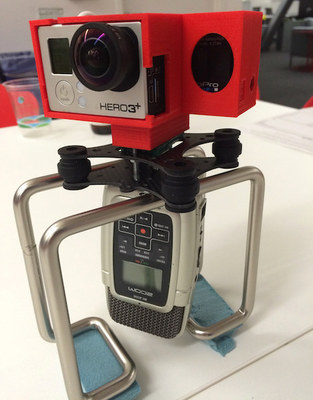
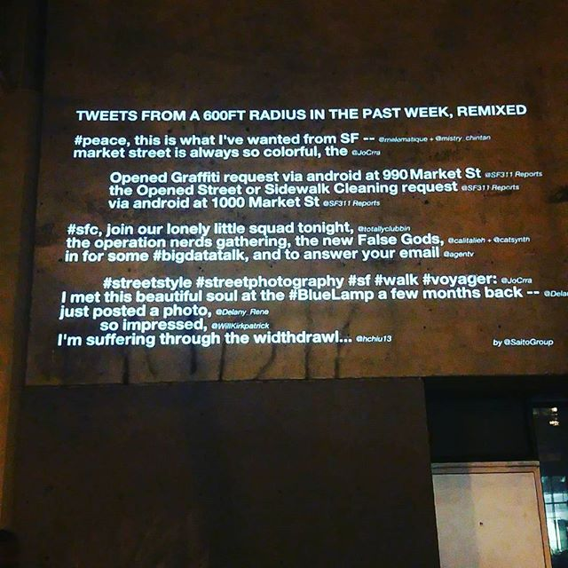

BuzzFeed Open Lab for Journalism, Technology, and the Arts  

<http://buzzfeed.com/openlab>

Amanda Hickman  
^^ Senior Fellow

NOTES:
I just want to walk through what the lab is working on and then I'll be in NYC for a few more days and I'd love to brainstorm collaborations with you all.

I run the lab; I'm on a two year fellowship.

Here's what we're up to. |

--v--
Ben Kreimer / [@benkreimer](http://twitter.com/benkreimer) -- Beta Fellow

  

Drones, 3d Printing, Helmet-mounted Air Quality Sensors, 360° Video & Audio

NOTES:
Ben is our drone fellow, but he's also been working on a helmet mount that would let cyclists (or motor cyclists) carry a mobile air quality sensor, and he's working with a reporter in the SF bureau on a calibrated noise monitoring project.

Ben also set up the lab.

--v--
Ainsley Sutherland / [@AAAinsley](http://twitter.com/AAAinsley)

<iframe width="560" height="315" src="https://www.youtube.com/embed/tHPejMRHTGc" frameborder="0" allowfullscreen></iframe>  <iframe width="560" height="315" src="https://www.youtube.com/embed/tdi8TAgMPR0" frameborder="0" allowfullscreen></iframe>

Virtual Reality Interactions, [360 Video](https://www.facebook.com/video.php?v=886303471490630)

[Valley Fire](https://www.facebook.com/BuzzFeedVideo/videos/1869492456524961/?fref=nf) | [YouTube Channel](https://www.youtube.com/channel/UCM8QPN7MZVldDfKv-bVTdEQ)

NOTES:
Ben and Ainsley have been collaborating on some great video projects. Their first video project went out to the site of a pretty devastating wildfire. 6 million views.

Ben probably has thoughts on process, but Motion Pictures is actively looking for great ideas for 360 video and you should feel free to pitch me or BFMP or your editor. If you're pitching me, let me know whether

--v--

Saito / [@saitogroup](https://twitter.com/SaitoGroup)   Privacy, Natural Language Processing, Computational Poetics, Digital Democracy, Community collaboration

 

[Another Projection](https://www.instagram.com/p/_f5JO-CuAY/?taken-by=saitogroup)

NOTES:
Saito is actually a collaborative, with one guy physically in the lab and a lot of collaborators passing through.

Scraping geolocated social media; Zayne stans

--v--
Westley Hennigh Palermo / [@WestleyArgentum](https://twitter.com/WestleyArgentum)

[Influence Game](http://influencegame.io/#/team-builder), Automated Journalism, Twitter Bots, SEC Watcher

NOTES:
I think a lot of you already met Westley.

--v--
Christine Sunu  / [@christinesunu](http://twitter.com/christinesunu)

<video controls="controls" width="800" height="600" name="Squeeze Buddy" src="../imgs/buzzfeed/SecondSqueeze.ogg"></video>

Internet of Things, Programmable Objects, Medicine

NOTES:
Christine is our resident med school drop out. She loves to answer questions about infectious disease and micro biomes. She is building a plush toy that knows how it is being treated.

She also built a doo-dad that raises and lowers her desk automatically, and a little servo that let's you take stereoscopic images much more precisely.

--v--
Christine Sunu  / [@christinesunu](http://twitter.com/christinesunu)

Internet of Things, Programmable Objects, Medicine

--v--

Me / @amandabee

Mapping, mad libs, privacy

--v--

 Find us at **#openlab-chat** and **#openlab-dev**  if you want to kick some ideas around. Or email me!

<http://buzzfeed.com/openlab>

NOTES:
There's also an #openlab channel but don't join that. We chat waaay too much in there. We'll open our call for new fellows very soon, so keep an eye out.
