BuzzFeed Open Lab for Journalism, Technology, and the Arts  

<http://buzzfeed.com/openlab>

Amanda Hickman <- Senior Fellow

\#openlab-chat / SLACK: @amanda / TWITTER: @amandabee / amanda.hickman@buzzfeed.com

NOTES:

The Open Lab is a workshop and fellowship program in the San Francisco bureau. We're part arts fellowship, part R&D lab. We get to approach some of the more interesting challenges in journalism from a product perspective, rather than edit. We're here to explore and pull at the edges of how we gather information and tell stories. And part of my project as the director is to loop us back into the editorial workflow.

--v--

Ainsley Sutherland / [@ainsley](http://twitter.com/AAAinsley) -- virtual reality, photogrammetry

Amanda Hickman / [@amanda](https://www.buzzfeed.com/amandahickman) -- data, mapping, privacy, FOIA, madlibs

Ben Kreimer / [@ben.kreimer](https://www.buzzfeed.com/benkreimer) -- drones, 3d printing, sensors, 360° audio, accessible tools.

Christine Sunu  / [@christine](https://www.buzzfeed.com/christinesunu) -- emotionally connected objects, IoT

[Saito](https://www.buzzfeed.com/saito?language=en) -- Privacy, Natural Language Processing, Computational Poetics, Digital Democracy, Community collaboration

Westley Hennigh Palermo / [@Westley](https://www.buzzfeed.com/westleyargentum?language=en) -- campaign finance, games, bots

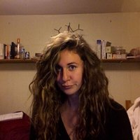 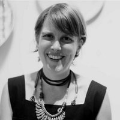 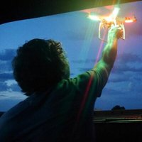    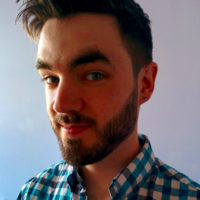

NOTES:
This is us.

--v--

## 360° Video

 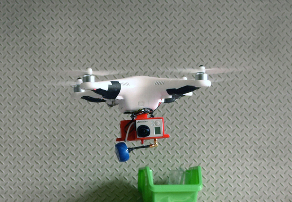

NOTES:
Ben is our drone fellow, but he's also been working on a helmet mount that would let cyclists (or motor cyclists) carry a mobile air quality sensor, and he's working with a reporter in the SF bureau on a calibrated noise monitoring project.

We have a helmet mount, which lets the bearer disappear into the camera's blind spot, as well as a handheld rig. We've tested a surf version. This is available. We have a couple of reporters who are signed up to use it but if you want to try it on a story, let us know and we'll get it to you. It is pretty well field tested .

--v--

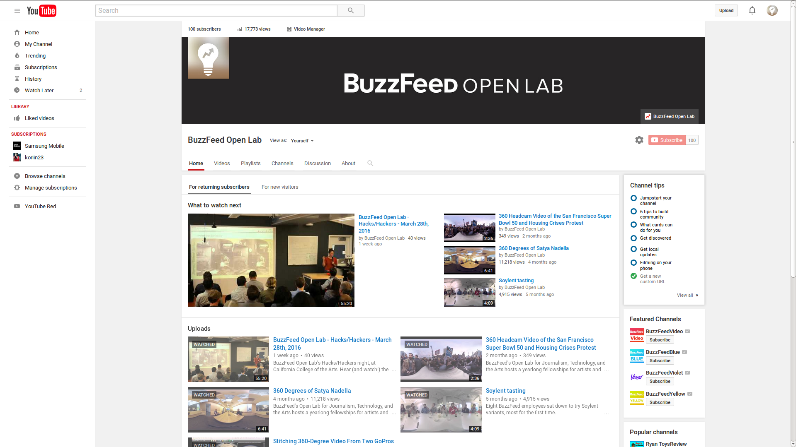

--v--

<iframe width="560" height="315" src="https://www.youtube.com/embed/J6fIoA0Yt1c" frameborder="0" allowfullscreen></iframe> <iframe width="560" height="315" src="https://www.youtube.com/embed/tHPejMRHTGc" frameborder="0" allowfullscreen></iframe>  <iframe width="560" height="315" src="https://www.youtube.com/embed/tdi8TAgMPR0" frameborder="0" allowfullscreen></iframe> <iframe width="560" height="315" src="https://www.youtube.com/embed/vMCR2VXuhFQ" frameborder="0" allowfullscreen></iframe>

NOTES:

--v--

## 4,328,770 Views

<iframe src="https://www.facebook.com/plugins/video.php?href=https%3A%2F%2Fwww.facebook.com%2FBuzzFeedVideo%2Fvideos%2Fvb.1318800798260799%2F1960125994128273%2F%3Ftype%3D3&show_text=0&width=560" width="560" height="315" style="border:none;overflow:hidden" scrolling="no" frameborder="0" allowTransparency="true" allowFullScreen="true"></iframe>

NOTES:
We produced a 360° video of the giants on opening day. Our rig weights a few lbs. Maybe two. There was someone there with a Jaunt, but it weighs 80lbs.

With our rig, you can get right up close -- with a six go-pro rig, if you come within 4ft of the camera, you run the risk of getting chopped to pieces (at least on film.)

We sent one reporter and an intern out to shoot this.

--v--

#pho·to·gram·me·try
## /ˌfōtəˈgramitrē/

## noun: photogrammetry

> the use of photography in surveying and mapping to measure distances between objects.

--v--

## Immersive Visualizations

[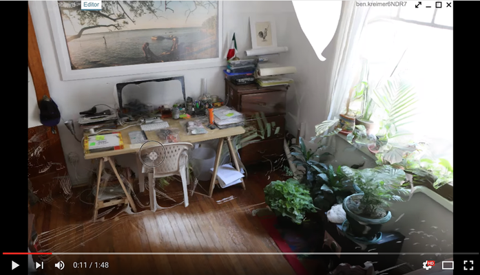](https://youtu.be/pzWj304yQac)  [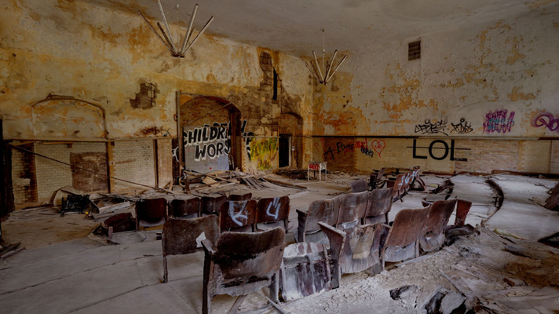](https://docs.google.com/a/buzzfeed.com/document/d/1RQTYmHissJtG9euQ9Cr9brDkh39WlkRTy5bnqwwPNUc/edit?usp=sharing)

NOTES:
We'd love to work with someone on this stuff.

--v--

## Object Reconstruction
[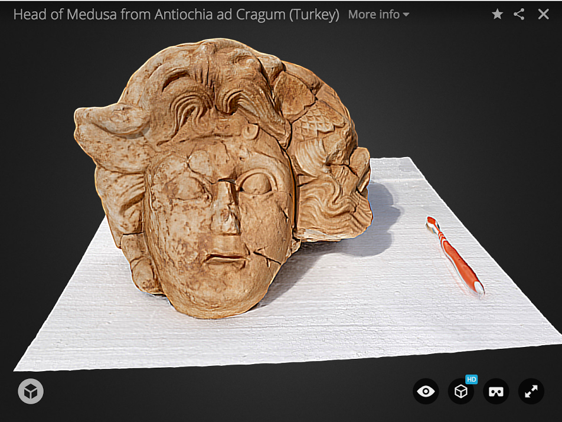](http://benkreimer.com/aerial-video-photography/antiochia-ad-cragum-aerial-survey/#medusa)

<http://benkreimer.com/aerial-video-photography/antiochia-ad-cragum-aerial-survey/#medusa>

NOTES:
Ben's project.

--v--

## Podcast Animation

[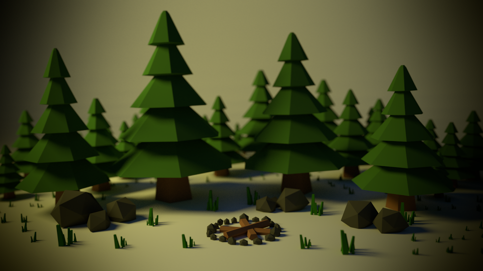](https://docs.google.com/a/buzzfeed.com/document/d/1RQTYmHissJtG9euQ9Cr9brDkh39WlkRTy5bnqwwPNUc/edit?usp=sharing)

--v--

##[Projections](https://www.instagram.com/saitogroup/)

 

[Another Projection](https://www.instagram.com/p/_f5JO-CuAY/?taken-by=saitogroup)

NOTES:
Saito is actually a collaborative, with one guy physically in the lab and a lot of collaborators passing through.

Scraping geolocated social media; Zayne stans

--v--
Westley Hennigh Palermo / [@WestleyArgentum](https://twitter.com/WestleyArgentum)

[Influence Game](http://influencegame.io/#/team-builder), Automated Journalism, Twitter Bots, SEC Watcher

[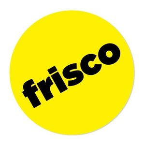](https://www.buzzfeed.com/westleyargentum/you-mean-frisco)   [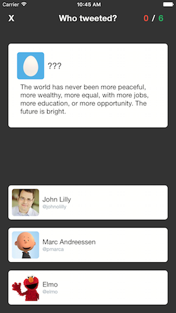](https://github.com/buzzfeed-openlab/shit-vcs-say)

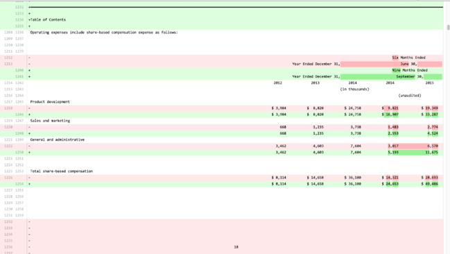

NOTES:
I think a lot of you already met Westley.

--v--
Christine Sunu  / [@christinesunu](http://twitter.com/christinesunu)

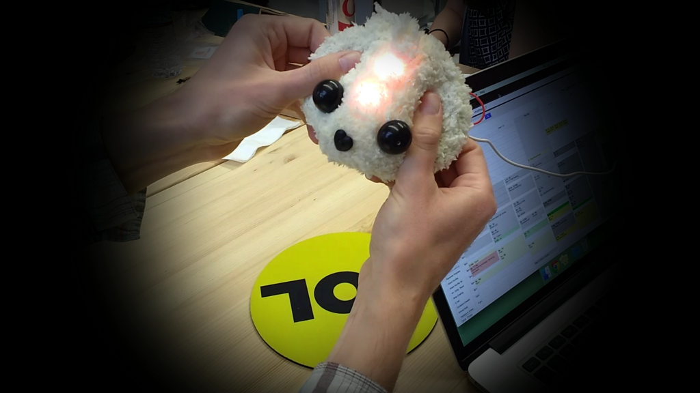

Puppy Feeder, Pothole Sensor, Buddy

NOTES:
Christine is our resident med school drop out. She loves to answer questions about infectious disease and micro biomes. She is building a plush toy that knows how it is being treated.

She also built a doo-dad that raises and lowers her desk automatically, and a little servo that let's you take stereoscopic images much more precisely.

--v--

<https://github.com/FOIA-data-hackathon>

--v--

## Open Source

+ <https://github.com/buzzfeed-openlab>
+ <http://www.thingiverse.com/OpenLab/about>
+ <https://buzzfeed.com/openlab>

Find us at **#openlab-chat** and **#openlab-dev**

NOTES:
There's also an #openlab channel but don't join that. We chat waaay too much in there. We'll open our call for new fellows very soon, so keep an eye out.
