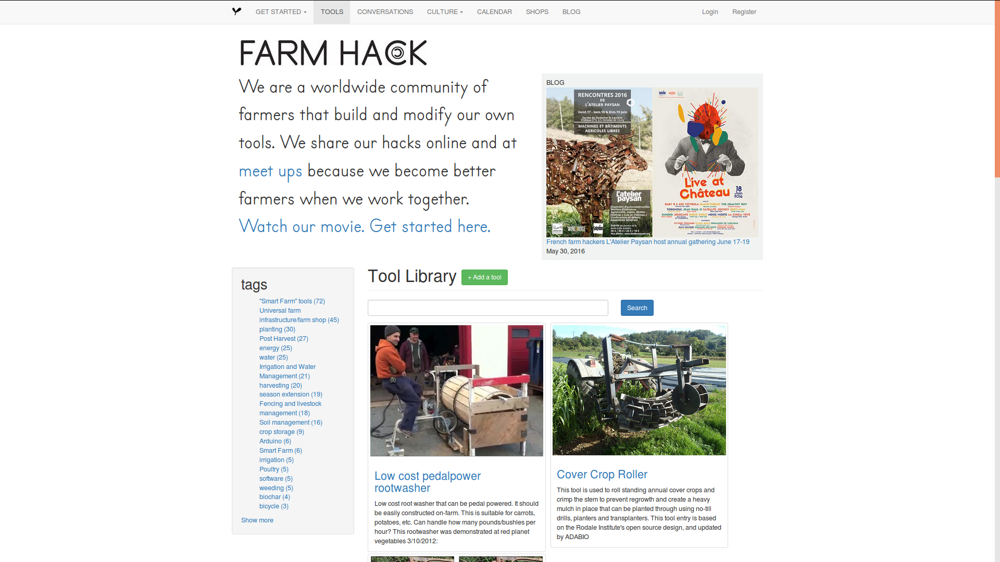
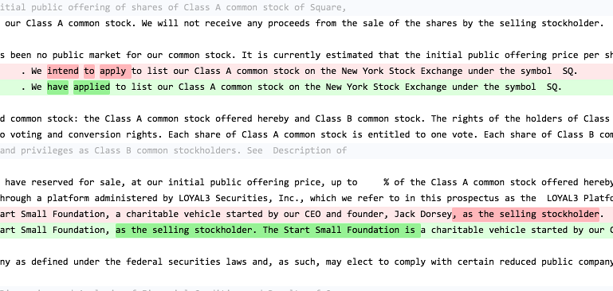
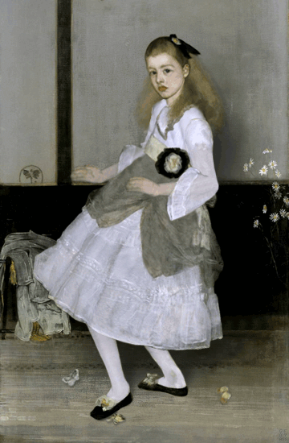
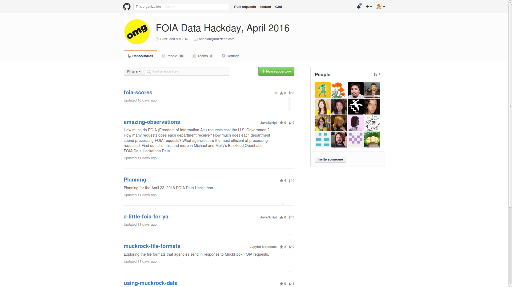

<section data-background="../imgs/bf_ol_big.png">
</section>

NOTES:

I run an art and technology residency at BuzzFeed called the Open Lab for Journalism, Technology, and the Arts.

We have five fellows who spend a year working or projects that combine programming and storytelling in creative ways. As a lab, our mission is to pull at the edges of how we tell stories and gather information. For us, that means that we're tinkering with mapping projections together so we can simulate an expensive 10,000 lumen projector with a few smaller projectors. It means we're experimenting with virtual reality interfaces and working with reporters to explore photogrammetry. We're building Facebook Messenger bots and teasing out ways to use comments on live video to turn the dial in an automated pet feeder. We're also building games about campaign finance and writing natural language parsers that can select excerpts on the fly from social media texts and compile them into poems about a changing city. <https://www.instagram.com/saitogroup/>

Everything we do is Open Source.  The big things that open source does for us, on a practical level, are these:

+ Fellows are here for a year. After that year, they'll go on and do amazing things. And they can take everything they worked on in the lab with them. And BuzzFeed can continue to use those things.

+ Our mission, as a lab, is not to be BuzzFeed's top secret R&D shop. We're here to change journalism. Or at least tug at the threads of what is possible. And we can't do that by showing everyone our finished product and saying 'wish you were here.'

-----

NOTES:

When we talk about Open Source, we mean a whole lot of different things. We mean mapping data in Open Street Maps, music and images released under Creative Commons licenses, the design for a really smart [prosthetic arm](http://openprosthetics.org/) or the plans for a [pedal powered root washer](http://farmhack.org/tools). And we mean code.

--v--

[Guide: 360° Camera](https://github.com/buzzfeed-openlab/big-picture/wiki/Guide:-360-Degree-Camera) | [EDGAR Diff + RSS Puppy](https://github.com/buzzfeed-openlab/rss-puppy)

NOTES:

For the lab, being "open" means that we document out of everything we do. We publish our code, we publish source files for our 3D prototypes, and we document our process. We're documenting it so that someone who is thinking about a similar project can look at what we built, what we found, how it worked.

But it is important to note that we're writing this code for ourselves. It is almost always worth documenting your own work, even if only so that when you go back to iterate on it you know why you wrote it the way you did.

We don't necessarily support our projects -- if you want to try to get something running  -- and that's an important distinction. Every now and then someone pick something up and run with it, and we're happy to answer questions when they do. But we're not trying to build the next WordPress or D3. We're just trying to do the best job we can of showing our work, so that if someone wants to know how we solved a weirdly sticky problem, we can show them.

--v--

NOTES:

## Collaboration
Being an "open" lab makes all kinds of things possible for us. It recognizes that the value of the lab, from an R&D perspective, is that BuzzFeed has access to this team of incredibly smart, creative people who are game to try new things. We have a team that is prepared to drop everything to build out a proof of concept because we think it is worth trying.

We wouldn't be able to do this without collaborators. Every one of us reaches out to our networks for guidance, mentoring, big thinking and little assists. That's basically true everywhere but I think that it matters to say "I'm not asking you to volunteer to help me build my business. This thing I'm building with your help ... you can use it, too. You don't have to reverse engineer it when I'm done. I'll document it."

## Journalism is Mission Driven

It is worth me also taking a moment to actually explain that I genuinely believe in journalism, because I believe in civic participation. I fundamentally believe that we are all responsible for the decisions that companies and policy makers make on our behalf, and that we need access to good information about the impact of those decisions or we can't participate meaningfully in Democracy.

And so, for me, one thing that means is that I look at journalism as a mission. I happen to love the newsroom I work in, but I'm far less interested in making BuzzFeed succeed than in helping newsrooms succeed. And I think that's true for a lot of people. Making new tools for BuzzFeed is not nearly as interesting as making something that you can expand on somewhere else, in some other context.

I also make a practice of *using* free and open source software whenever possible, because I think that access to quality software matters a great deal and I know that by using software I'm actually making software better.

## Using software *is* contributing to software.

When you use a tool you build community around that tool. Even if you don't realize it. Because eventually you're going to show a frustrated co-worker that there's another view they can use, one that's way easier. Someone is going to ask you why our office slack has a LaCroix emoji and no one else's does and you might laugh and say "I'm not telling" but eventually they're going to figure out how you did that. And then they'll do it and then they'll be better at using Slack, too. Bit by bit, we build community around the tools we use. You send someone an MS Word document and they realize that you're doing something really smart with outlines. They know it can be done, they do it to.

I use LibreOffice day to day, and so when a friend get stuck on a spreadsheet task and asks for help, I usually wind up saying "huh. Here's how I'd solve that in Calc. My guess is that Excel works the same way." It often does, but the more often I point that out the easier it is for someone to decide they're not going to spend $100 on MS Office, they're going to try using Calc.

A side note, if we need it: Calc is not built by a team of benevolent helpful programmers. It is supported by people who make their living providing support for the software. Or by firms that need a working office suite for their entire organization and are willing to work to make Calc better instead of buying MS licenses for everyone.

Every time you post a question on a public forum, or ask for help, you're building community around something.

I'm learning to sew clothing and I realized (a tiny bit too late) that basically no one on public forums sews from Lotta Jansdotter patterns but everyone and their mother has tried making the Grainline Archer and the Scout. And if I were working on either of those patterns, I could go to Burda Style or [Textillia](https://www.textillia.com) and find a half dozen other woman who also tried to modify the arms on the Archer. That community makes all the difference. That community means I can see how the shirt drapes in different fabric or on different bodies.

--v--

BuzzFeed Open Lab for Journalism, Technology, and the Arts  

<https://buzzfeed.com/openlab>

Amanda Hickman <-- Senior Fellow

@amandabee / amanda.hickman@buzzfeed.com

<https://tinyletter.com/openlab>

NOTES:

Stay in touch.

--v--

BuzzFeed Open Lab for Journalism, Technology, and the Arts  

<https://buzzfeed.com/openlab>

Amanda Hickman <-- Senior Fellow

@amandabee / amanda.hickman@buzzfeed.com

<https://tinyletter.com/openlab>

NOTES:

Stay in touch.

--v--

<https://github.com/FOIA-data-hackathon>

NOTES:

We also organize events like a day of digging through FOIA Data.

--v--

There's a weirdly persistent and pernicious myth that free software is all developed by benevolent hacker-volunteers, totally without remuneration. The truth is that if you look at some of the most successful open source software projects: the GNU/Linux operating system, Python, D3, you're actually looking at tools that are built by the people who use them. Sometimes we're talking about the tools that programmers use to do their jobs (the jobs they get paid for), sometimes we're talking about tools that a lot of people, including programmers, use to manage their lives. Either way, the impulse is usually to contribute to a tool that you need, for yourself, because you need it to work better.
